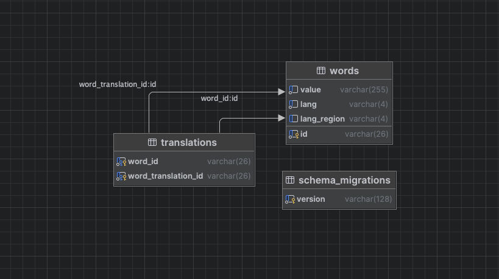
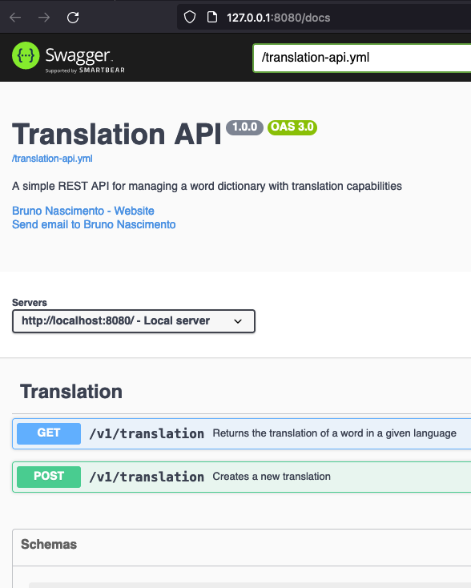

## Translation API
This is a Back-end API for managing a word dictionary with translation capabilities.

### Generating code

Install sqlc: 
`go install github.com/sqlc-dev/sqlc/cmd/sqlc@latest`

Run it:
`sqlc generate`

To generate the mocks and openapi files, run:
`go generate ./...`

### Running
`docker compose up --build`

#### Environment variables
| Variable Name          | Value                                                       | Description                                           |
|------------------------|-------------------------------------------------------------|-------------------------------------------------------|
| COMPONENT              | `translation-api  `                                         | name of the service - used for logging                |
| CACHE_ENABLED          | `true `                                                     | if enable will use a cached version of the repository |
| CACHE_REDIS_ADDR       | `redis:6379 `                                               |                                                       |
| CACHE_TTL              | `15s`                                                       | how long to cache the repository for                  |
| LOG_LEVEL              | `debug`                                                     |                                                       |
| LOG_PRETTY_PRINT       | `true ` `                                                   | if you want json format, set this to false            |
| DB_URL                 | `postgres://postgres:root@db:5432/postgres?sslmode=disable` |                                                       |
| OPENAPI_SPEC_PATH      | `/translation-api.yml `                                     |                                                       |
| SERVER_PORT            | `8080  `                                                    |                                                       |
| SERVER_HOST            | `0.0.0.0      `                                             |                                                       |

### Migrations

To create a migration, run the following command:
`docker run --rm -it --network=host -v "$(pwd)/sql:/db" ghcr.io/amacneil/dbmate new remove_languages_table`

The migrations run on startup, but you can also run them manually with:
`docker run --rm -it --network=host -v "$(pwd)/sql:/db" ghcr.io/amacneil/dbmate up`

### DB Schema

### API Documentation

Swagger UI: http://127.0.0.1:8080/docs

### How it works

I tried to stay as close as possible to the requirements, but I did make some assumptions:

- A word can have multiple translations, so the endpoint is returning a list of translations.
- When your search for a translation doesn't return any results, we send a 404 status code with list of suggestions containing the closest matches in the same language as the search term.
- You can have a cached implementation of the repository, which will cache the results for a given amount of time. This is useful for when you have a lot of reads and not a lot of writes. The cache invalidation needs more time to be implemented, but it's a good start.

I hope you like it!